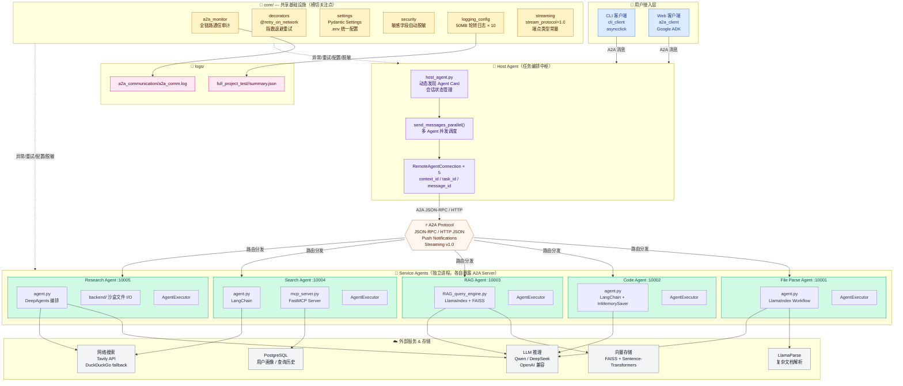
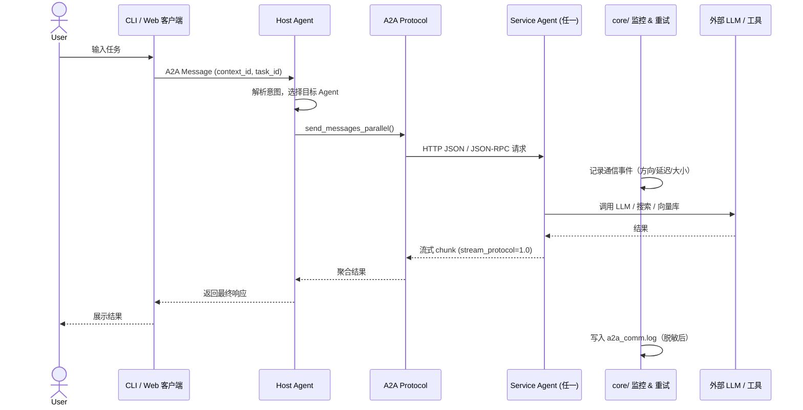
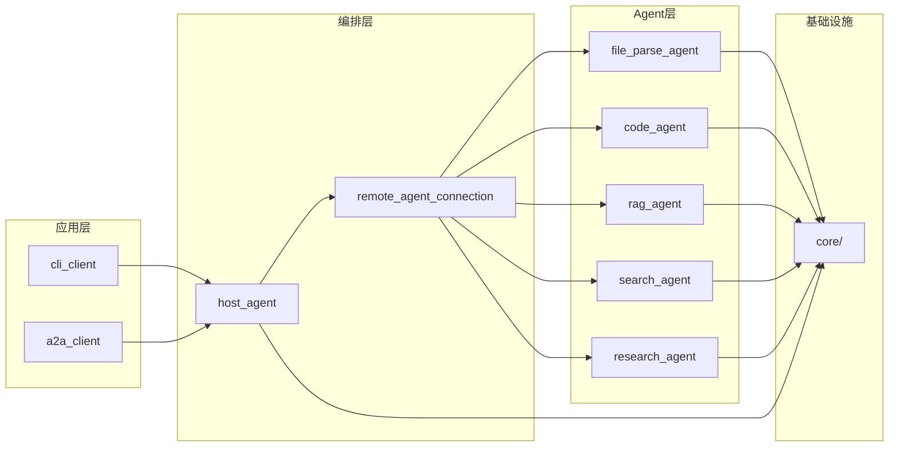

# 依天学境 — 核心架构图

```mermaid
flowchart TD
    %% ─────────────── 用户接入层 ───────────────
    subgraph CLIENT["👤 用户接入层"]
        direction LR
        CLI["CLI 客户端\ncli_client\nasyncclick"]
        WEB["Web 客户端\na2a_client\nGoogle ADK"]
    end

    %% ─────────────── Host Agent ───────────────
    subgraph HOST["🧠 Host Agent（任务编排中枢）"]
        direction TB
        HA["host_agent.py\n动态发现 Agent Card\n会话状态管理"]
        PARALLEL["send_messages_parallel()\n多 Agent 并发调度"]
        RAC["RemoteAgentConnection × 5\ncontext_id / task_id / message_id"]
        HA --> PARALLEL --> RAC
    end

    %% ─────────────── A2A 协议层 ───────────────
    PROTO{{"⚡ A2A Protocol\nJSON-RPC / HTTP JSON\nPush Notifications\nStreaming v1.0"}}

    %% ─────────────── 服务 Agent 层 ───────────────
    subgraph AGENTS["🤖 Service Agents（独立进程，各自暴露 A2A Server）"]
        direction LR

        subgraph FP["File Parse Agent :10001"]
            FP1["agent.py\nLlamaIndex Workflow"]
            FP2["AgentExecutor"]
        end

        subgraph CA["Code Agent :10002"]
            CA1["agent.py\nLangChain + InMemorySaver"]
            CA2["AgentExecutor"]
        end

        subgraph RA["RAG Agent :10003"]
            RA1["RAG_query_engine.py\nLlamaIndex + FAISS"]
            RA2["AgentExecutor"]
        end

        subgraph SA["Search Agent :10004"]
            SA1["agent.py\nLangChain"]
            SA2["mcp_server.py\nFastMCP Server"]
            SA3["AgentExecutor"]
        end

        subgraph RE["Research Agent :10005"]
            RE1["agent.py\nDeepAgents 编排"]
            RE2["backend/ 沙盒文件 I/O"]
            RE3["AgentExecutor"]
        end
    end

    %% ─────────────── core/ 基础设施 ───────────────
    subgraph CORE["🔧 core/ — 共享基础设施（横切关注点）"]
        direction LR
        MON["a2a_monitor\n全链路通信审计"]
        DEC["decorators\n@retry_on_network\n指数退避重试"]
        SET["settings\nPydantic Settings\n.env 统一配置"]
        SEC["security\n敏感字段自动脱敏"]
        LOG["logging_config\n50MB 轮转日志 × 10"]
        STR["streaming\nstream_protocol=1.0\n端点类型常量"]
    end

    %% ─────────────── 外部服务 ───────────────
    subgraph EXT["☁️ 外部服务 & 存储"]
        direction LR
        LLM["LLM 推理\nQwen / DeepSeek\nOpenAI 兼容"]
        LP["LlamaParse\n复杂文档解析"]
        VS["向量存储\nFAISS + Sentence-Transformers"]
        PG["PostgreSQL\n用户画像 / 查询历史"]
        WS["网络搜索\nTavily API\nDuckDuckGo fallback"]
    end

    %% ─────────────── 日志输出 ───────────────
    subgraph LOGS["📁 logs/"]
        L1["a2a_communication/a2a_comm.log"]
        L2["full_project_test/<timestamp>/summary.json"]
    end

    %% ─────────────── 连线：用户 → Host ───────────────
    CLI -->|"A2A 消息"| HOST
    WEB -->|"A2A 消息"| HOST

    %% ─────────────── Host → Agent ───────────────
    RAC -->|"A2A JSON-RPC / HTTP"| PROTO
    PROTO -->|"路由分发"| FP
    PROTO -->|"路由分发"| CA
    PROTO -->|"路由分发"| RA
    PROTO -->|"路由分发"| SA
    PROTO -->|"路由分发"| RE

    %% ─────────────── Agent → 外部服务 ───────────────
    FP1 --> LP
    FP1 --> LLM
    CA1 --> LLM
    RA1 --> VS
    RA1 --> LLM
    SA1 --> WS
    SA2 --> PG
    RE1 --> LLM
    RE1 --> WS

    %% ─────────────── core/ 横切 ───────────────
    CORE -. "异常/重试/配置/脱敏" .-> HOST
    CORE -. "异常/重试/配置/脱敏" .-> AGENTS
    MON --> L1
    LOG --> L2

    %% ─────────────── 样式 ───────────────
    classDef clientStyle fill:#dbeafe,stroke:#3b82f6,color:#1e3a8a
    classDef hostStyle fill:#ede9fe,stroke:#7c3aed,color:#2e1065
    classDef agentStyle fill:#d1fae5,stroke:#059669,color:#064e3b
    classDef coreStyle fill:#fef3c7,stroke:#d97706,color:#451a03
    classDef extStyle fill:#f3f4f6,stroke:#6b7280,color:#111827
    classDef logStyle fill:#fce7f3,stroke:#db2777,color:#500724
    classDef protoStyle fill:#fff7ed,stroke:#ea580c,color:#431407

    class CLI,WEB clientStyle
    class HA,PARALLEL,RAC hostStyle
    class FP,CA,RA,SA,RE agentStyle
    class MON,DEC,SET,SEC,LOG,STR coreStyle
    class LLM,LP,VS,PG,WS extStyle
    class L1,L2 logStyle
    class PROTO protoStyle
```

---

## 核心数据流

```mermaid
sequenceDiagram
    actor User
    participant CLI as CLI / Web 客户端
    participant Host as Host Agent
    participant Proto as A2A Protocol
    participant Agent as Service Agent (任一)
    participant Core as core/ 监控 & 重试
    participant Ext as 外部 LLM / 工具

    User->>CLI: 输入任务
    CLI->>Host: A2A Message (context_id, task_id)
    Host->>Host: 解析意图，选择目标 Agent
    Host->>Proto: send_messages_parallel()
    Proto->>Agent: HTTP JSON / JSON-RPC 请求
    Core->>Core: 记录通信事件（方向/延迟/大小）
    Agent->>Ext: 调用 LLM / 搜索 / 向量库
    Ext-->>Agent: 结果
    Agent-->>Proto: 流式 chunk (stream_protocol=1.0)
    Proto-->>Host: 聚合结果
    Host-->>CLI: 返回最终响应
    CLI-->>User: 展示结果
    Core->>Core: 写入 a2a_comm.log（脱敏后）
```

---

## 模块依赖关系

```mermaid
graph LR
    subgraph 应用层
        CLI_M[cli_client]
        WEB_M[a2a_client]
    end
    subgraph 编排层
        HOST_M[host_agent]
        CONN[remote_agent_connection]
    end
    subgraph Agent层
        FPM[file_parse_agent]
        CAM[code_agent]
        RAM[rag_agent]
        SAM[search_agent]
        REM[research_agent]
    end
    subgraph 基础设施
        CORE_M[core/]
    end

    CLI_M --> HOST_M
    WEB_M --> HOST_M
    HOST_M --> CONN
    CONN --> FPM & CAM & RAM & SAM & REM
    FPM & CAM & RAM & SAM & REM --> CORE_M
    HOST_M --> CORE_M
```
